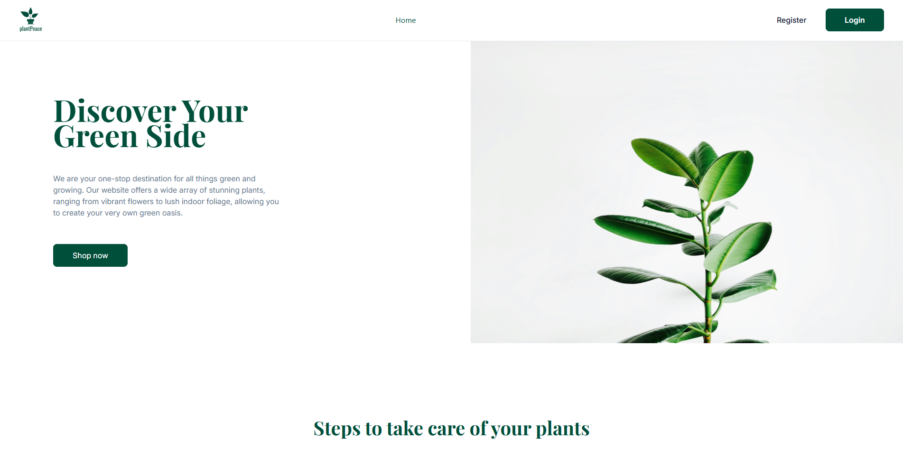

# Plant Peace 🪴




## Sobre o Projeto 📄

Este repositório faz parte do desafio 2 do Programa de Bolsas da Compass UOL de front-end. O desafio consiste em desenvolver um e-commerce de floricultura intitulado como Plant Peace.

## Funcionalidades ✨

Foram aplicados conhecimentos por meio das tecnologias HTML, CSS, Tailwind, TypeScript, React, Clerk e JSON para estruturar um sistema visual e interativo que permitisse realizar algumas funcionalidades, tais como: login e registro de usuários, cadastro e edição de produtos, bem como a pesquisa e classificação dos mesmos por meio de categorias no catálogo.

## Tecnologias Usadas 🛠️

      


## Como Rodar o Projeto Localmente 🚀

1. Clone o repositório:
   ```sh
   git clone https://github.com/LeonardoNoll/ARD24_D02_2.git
   ```

2. Navegue até o diretório do projeto:
   ```sh
   cd ARD24_D02_2
   ```
3. Instale as dependências:
  
    Dependências
   ```sh
   npm install
   ```

    Acesso aos registros
   ```sh
   npm run server
   ```

4. Inicie o servidor de desenvolvimento:
   ```sh
   npm run dev
   ```

## Colaboradores 🤝
<table>
        <thead>
            <tr>
                <th>Nome</th>
                <th>GitHub</th>
            </tr>
        </thead>
        <tbody>
            <tr>
                <td><b>Adércio Barbuio Junior </b></td>
                <td><a href="https://github.com/barbuiojr" target="_blank">https://github.com/barbuiojr</a></td>
            </tr>
            <tr>
                <td><b>Cristian Doring Molon</b></td>
                <td><a href="https://github.com/cristiandoring" target="_blank">https://github.com/cristiandoring</a></td>
            </tr>
            <tr>
                <td><b>Felipe Cirne da Silva </b></td>
                <td><a href="https://github.com/felpscirne" target="_blank">https://github.com/felpscirne</a></td>
            </tr>
            <tr>
                <td><b>Leonardo Noll Cruz </b></td>
                <td><a href="https://github.com/LeonardoNoll" target="_blank">https://github.com/LeonardoNoll</a></td>
            </tr>
            <tr>
                <td><b>Rayanne Albuquerque Marques </b></td>
                <td><a href="https://github.com/Artemis-Rayo" target="_blank">https://github.com/Artemis-Rayo</a></td>
            </tr>
            <tr>
                <td><b>Edson Moreira da Costa Filho</b></td>
                <td><a href="https://github.com/devedsoncosta" target="_blank">https://github.com/devedsoncosta</a></td>
            </tr>
            <tr>
                <td><b>Hewerton Adao da Paz</b></td>
                <td><a href="https://github.com/Hewerton80" target="_blank">https://github.com/Hewerton80</a></td>
            </tr>
             <tr>
                <td><b>Jailson de Souza</b></td>
                <td><a href="https://github.com/jailsoncompass" target="_blank">https://github.com/jailsoncompass</a></td>
            </tr>
        </tbody>
    </table>
